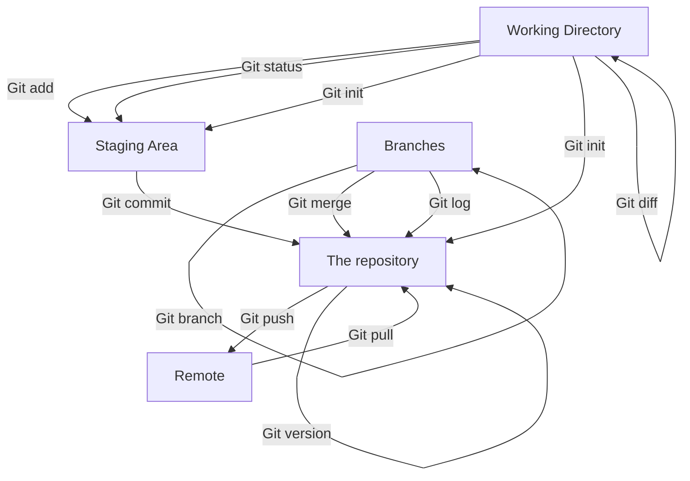

# My personal wiki

## Tools

### Web Browser (Microsoft Edge)

[![Edge][edge]][edge-url]

### Programming platform (Visual Studio Code)

[![VSCode][vscode]][vscode-url]

### Git

[![Git][git]][git-url]

## Purpose and motivation for these choices:

Microsoft Edge is a web browser that is built in along with windows and works well for programming.

Visual Studio Code is a platform often used in programming. It's what I've been working with for most of my programming and also supports Git alongside with tons of other features.

I frequently use git along with the command prompt to create projects, open folders, push and pull folders and more. It is also

## Important Local git commands:

1. Git commit is used to stage your changes and you often write a description for the commit so others and yourself included know what the purpose of the change is.

2. Git init is used to create a new git repository that is empty.
3. Git log gives the user a display list of a repositories
4. Git add stages changes, so that git understands which changes you want to include in your next commit.
5. Git config is used to define what the name of the author of a repository is. It can also be used to configure what email or alias that the user wants to be displayed.
6. Git merge is used to merge branch to the main branch.
7. Git status gives conditions for which files are staged or unstaged.
8. Git version displays which version of git that is running.

9. Git checkout is commonly used to detach, switch, from one branch to another.

10. Git diff shows you the changes that is unstaged between index and working directory.

11. Git branch

## Remote Git Commands

1. Git pull is used to "pull" or get the new changes from a project folder, pulling the information.

2. Git push, similiar to pull but "pushes" new information, which means the changes you've done gets added to the project folder.

3. Git clone is used to clone a project folder

4. Git remote add name --url is used to connect to a certain repository

5. Git fetch

# Git diagram

# FAQ

### What is a merge conflict?

Merge conflicts happens on the regular while people in a team works and edits in the same project. It is caused by more than one person working and writing new or editing old code on the same lines, in the same file. You are basically interfering with eachothers code as you're working from two different computers. The actual conflict appears afer two people have made edits to a file. The first person to commit their changes will not be affected, but the second person will be notified that their work is conflicting with other changes.

### How can you solve merge issues?

A merge conflinct is not super difficult to solved once it happens. When working with other people you can always divide the work between each other which allows you to work on different parts of the project, in different files. This prevents merge conflicts and other issues, which saves you time.

### What should you do when merge conflicts happens?

With help from Git most merge conflicts can be, as previously mentioned, easily solved. The second person will be notified of the confliction in the code and gets responible to resolve it. You then accept or reject the parallel work that was done in the file. The person can move code segments that interfere with eachother on the same lines to fix the merge conflict.

### What is Github?

Github is a great asset to programmers as it allows them to store and track their previous projects. It also makes it very accesible for groups to collaborate on projects. Developers can in other words share their code files to eachother while Github also serves as an platform for networking and communication.

### More about Github!

Since your Github account should be kept secure you also have to authenticate the account. This also allows you to gain access to certain resources on there.

[vscode]: https://img.shields.io/badge/Visual_Studio_Code-0078D4?style=for-the-badge&logo=visual%20studio%20code&logoColor=white
[vscode-url]: https://code.visualstudio.com/
[edge]: https://img.shields.io/badge/Microsoft_Edge-0078D7?style=for-the-badge&logo=Microsoft-edge&logoColor=white
[edge-url]: https://www.microsoft.com/edge
[git]: https://img.shields.io/badge/GIT-E44C30?style=for-the-badge&logo=git&logoColor=white
[git-url]: https://git-scm.com/
